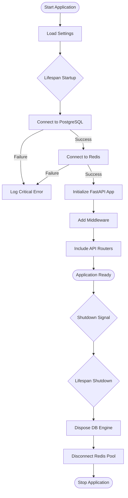
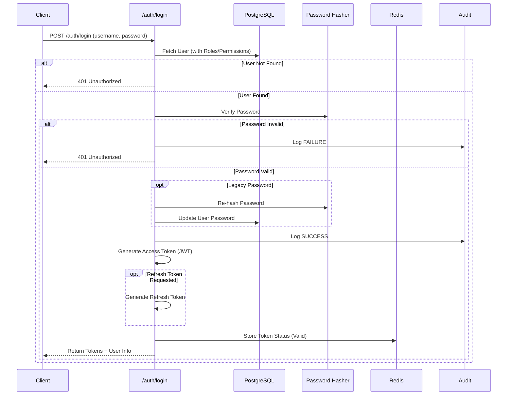
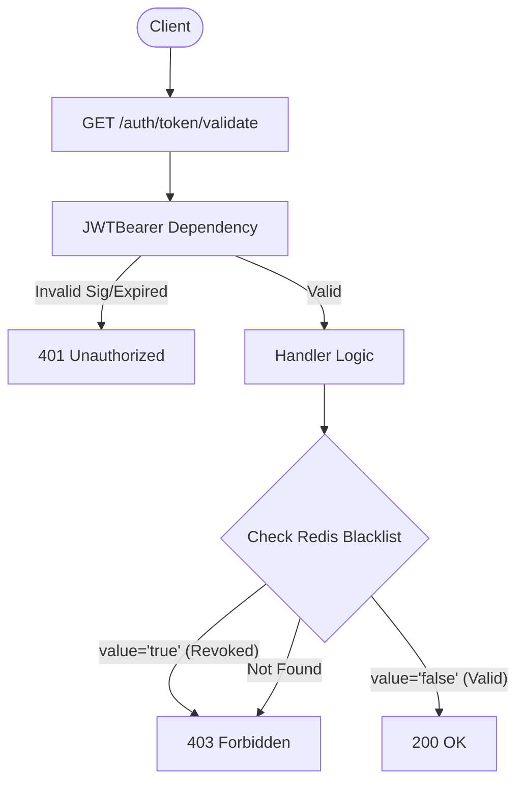

# FastAPI Application Documentation

This document provides a comprehensive overview of the FastAPI application's workflows, architecture, and potential areas for improvement.

## 1. Introduction

The Fausto Auth Service is a FastAPI-based backend designed for authentication and authorization. It manages users, roles, permissions, and audit logs. The system uses **PostgreSQL** (via SQLAlchemy) for persistent storage and **Redis** for ephemeral token status management (allow/block lists).

### Key Technologies
- **FastAPI**: Web framework.
- **SQLAlchemy (Async)**: ORM for database interactions.
- **Redis**: Caching and token management.
- **PyJWT**: JSON Web Token handling.
- **Argon2 / Bcrypt**: Password hashing.

---

## 2. Application Lifecycle

The application startup and shutdown processes are managed in `fastapi/run.py` using `lifespan` events.



### Components
- **`lifespan`**: Defines the startup and shutdown logic.
- **`AsyncSessionFactory`**: Ensures database connectivity on startup.
- **`async_token_store`**: Checks Redis connectivity.

---

## 3. Authentication Workflows

The authentication module (`fastapi/auth`) handles login, logout, and token management.

### 3.1 Login Flow (`POST /auth/login`)

This endpoint validates credentials and issues JWTs.



### 3.2 Token Validation (`GET /auth/token/validate`)

Validates if a token is active and not revoked.



### 3.3 Logout Flow (`POST /auth/logout`)

Revokes the current access token.

```mermaid
graph LR
    Client([Client]) --> Request[POST /auth/logout]
    Request --> JWTBearer[Verify Token]
    JWTBearer --> Handler[Handler Logic]
    Handler --> Redis[Set Token = 'true' (Revoked)]
    Redis --> Response[200 OK]
```

---

## 4. Request/Response Architecture

The application uses a standardized wrapper to ensure consistent API responses.

### The `fapi_wrapper` Pattern

Located in `fastapi/fausto/fapi.py`, this decorator intercepts route responses.

```mermaid
flowchart TD
    Request([Incoming Request]) --> RouteHandler[Route Handler]
    RouteHandler --> ReturnValue{Return Value}

    ReturnValue -- Tuple --> Unpack[Unpack (message, data, error)]
    ReturnValue -- String --> WrapString[Wrap {message: str}]
    ReturnValue -- Dict --> UseDict[Use as is]

    Unpack & WrapString & UseDict --> CheckError{Error is True?}

    CheckError -- Yes --> RaiseHTTP[Raise HTTPException]
    CheckError -- No --> StandardRes[Return JSON Response]

    StandardRes --> Client([Client])
```

**Standard Response Format:**
```json
{
  "message": "Operation successful",
  "error": false,
  "data": { ... }
}
```

---

## 5. Improvements & Recommendations

Based on the code analysis, here are identified areas for improvement:

### 5.1 Architecture & Design
- **Direct Service Dependency**: The `AuthService` handles HTTP exceptions (`ControllerError`) directly. It would be cleaner to let the service return domain objects or standard exceptions, and let the router or a middleware map them to HTTP responses.
- **Implicit Global Dependencies**: The `AuthService` relies on global `async_token_store` and `pwd_context`. Injecting these dependencies would improve testability.

### 5.2 Security
- **Legacy Password Handling**: The `validate_user` method contains logic to check for plain-text passwords and upgrade them. If all users are migrated, this fallback should be removed to prevent accidental exposure if hashing fails.
- **Token Blacklisting Strategy**: Currently, valid tokens are stored with `value="false"`. A more standard "Deny List" approach would only store revoked tokens, reducing Redis memory usage (valid tokens are verified by signature). *However, the current "Allow List" approach offers tighter security by ensuring only server-issued tokens are accepted.*

### 5.3 Performance
- **Eager Loading**: The login query `selectinload`s a deep hierarchy (`User -> Role -> RolePermission -> Permission`). Ensure this is necessary for every login. If the token only needs role names, this fetch size can be reduced.

### 5.4 Code Quality
- **`fapi_wrapper` Complexity**: The wrapper tries to handle tuples, strings, and dicts. Standardizing return types from services (e.g., always returning a Pydantic model or a Result object) would make the code more predictable and type-safe.
